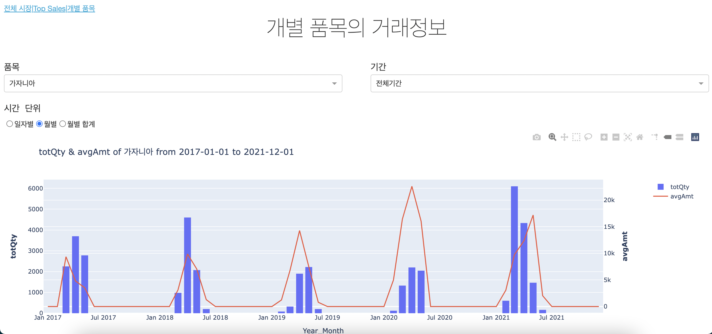

# 한국 화훼 공판장 경매 정보 대시보드

## 프로젝트 설명
한국의 화훼공판장 경매 정보를 [Dash](https://plotly.com/dash/) 를 이용해 대시보드로 시각화합니다. (그 결과를 [Heroku](http://heroku.com/) 를 이용해 웹사이트로 구축합니다.)
이 대시보드를 통해 화훼 작물의 품종별 거래량 및 평균 가격의 변화 추이를 확인할 수 있습니다. 

## 데이터
시각화에 사용한 데이터는 [화훼유통정보시스템](https://flower.at.or.kr/) 에서 제공하는 공공데이터로
2017년 1월부터 2021년까지 12월까지 'at양재'에서 거래된 품목/품종별 경매 정보 입니다.

- Data 수집: [Flower_DataCollect.ipynb](https://github.com/JayAhn0104/Dash_Plolty/blob/master/Flower_DataCollect.ipynb)

## 대시보드 개괄
대쉬보드 웹사이트는 총 3페이지로 분리되어 있습니다. 
1. 전체 시장
   - 시장 전체의 거래량 및 평균 거래금액 요약
2. 상위 거래 품중
   - 년도별/월별 거래량 및 평균 거래금액 기준 상위 일부 품종들에 대한 정보
3. 개별 품종
   - 개별 품종에 대한 거래량 및 평균 거래금액

| 전체시장                                                                                                                                | Top_Sale                                                                                                                                | 개별품목                                                                                                                                |
|-----------------------------------------------------------------------------------------------------------------------------------------|-----------------------------------------------------------------------------------------------------------------------------------------|-----------------------------------------------------------------------------------------------------------------------------------------|
|  |  |  |

## 대시보드 웹사이트 링크
아래 링크를 통해 완성된 대시보드를 제공하는 웹사이트로 접속할 수 있습니다. 

[https://korea-flower.herokuapp.com/](https://korea-flower.herokuapp.com)

